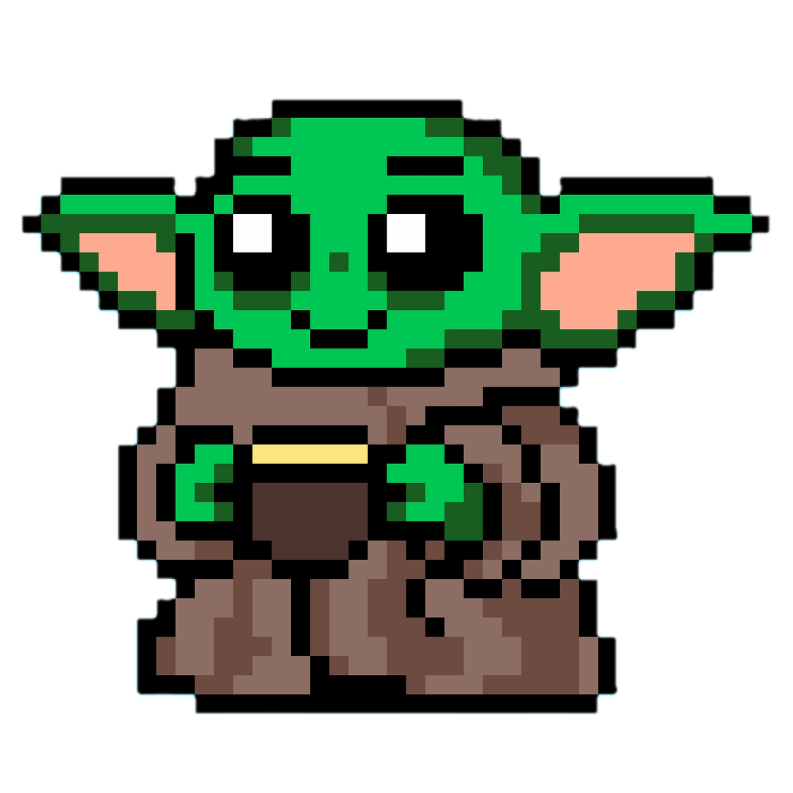
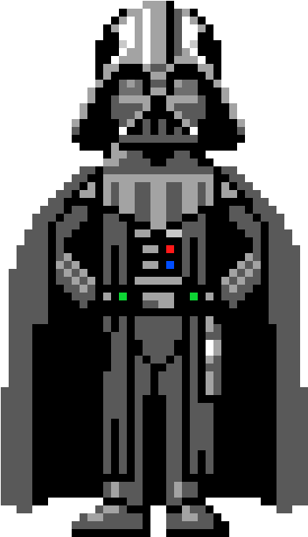

<div align="center">

# 💧 Hydrate Buddy

**A tiny desktop companion that nudges you to drink water — a pixel‑art pet that walks in to remind you.**

[](https://tauri.app)
[](https://www.rust-lang.org/)
[](https://developer.mozilla.org/en-US/docs/Web/JavaScript)
[](#-production-build)
[](#-license)


</div>

Hydrate Buddy lives in your **system tray**. On your chosen interval a little character
strolls in with a speech bubble, reminding you to hydrate. Tap **YES, I DRANK** and they
celebrate with confetti, then wander off until the next nudge. Four themed characters,
configurable intervals, snooze, and personalized messages — all wrapped in a single,
fast, native app.

> ℹ️ This is the **Tauri (Rust)** port, on the `tauri` branch. The `main` branch holds the
> original Electron version.

---

## ✨ Features

- 🐾 **Desktop pet** that walks in and out with smooth sprite animation
- 🎨 **Four themes** — Default doll, Baby Yoda, Darth Vader, and an animated Wizard
- 🧭 **System‑tray menu** — *Drink now*, reminder interval, snooze, theme picker, pause, quit
- ⏱️ **Smart scheduler** — respects active hours (10:00–23:00 local) and survives sleep/wake
- ✍️ **Personalized nudges** — set your name for messages that call you out by name
- 💾 **Persistent settings** — your preferences are saved to disk
- 🖥️ **Cross‑platform** — one codebase for Linux, macOS, and Windows
- 🔒 **Locked‑down by default** — strict CSP and least‑privilege capabilities

---

## 🧙 Meet the crew

| Default doll | Baby Yoda | Darth Vader | Wizard |
|:---:|:---:|:---:|:---:|
|  |  |  |  |

Each character brings its own colors, prompts, confetti, and the Wizard even has full
walk / drink / cast / celebrate frame animations.

---

## ⬇️ Download & install (no build needed)

Grab a ready‑made installer from the [**Releases**](https://github.com/jocsas/drink-water-buddy/releases) page — no clone, no toolchain, no `npm run tauri build`.

| OS | Download | Install |
|---|---|---|
| **Linux** | `.deb` or `.AppImage` | `sudo dpkg -i hydrate-buddy_*_amd64.deb`, or `chmod +x` the `.AppImage` and double‑click |
| **macOS** | `.dmg` (universal — runs on Apple Silicon and Intel) | Open the `.dmg`, drag **Hydrate Buddy** to `/Applications` |
| **Windows** | `.msi` or `.exe` | Run the installer |

### 🍎 macOS first run — remove the "damaged" warning

The app is not signed with an Apple Developer certificate, so macOS shows
*“Hydrate Buddy.app is damaged and can’t be opened”* on first launch. It isn't
actually damaged — that's just Gatekeeper's quarantine flag on downloaded apps.
After dragging the app to `/Applications`, run once in **Terminal**:

```bash
xattr -cr "/Applications/Hydrate Buddy.app"
```

Then open the app normally. Only ever do this for software you trust.
(Proper signing + notarization is on the [Roadmap](#-roadmap--known-issues).)

### 🪟 Windows first run

SmartScreen may show *"Windows protected your PC"* — click **More info → Run anyway**
(app is unsigned).

---

## 📦 Quick start (development)

### 1. Prerequisites

| Tool | Notes |
|---|---|
| **Node.js** + **npm** | LTS recommended |
| **Rust** | install via [rustup](https://rustup.rs) (`stable` toolchain) |
| **Git** | to clone the repo |

**Linux only** — Tauri needs a few system libraries (Ubuntu/Debian/Mint):

```bash
sudo apt-get update
sudo apt-get install -y \
  libwebkit2gtk-4.1-dev build-essential curl wget file \
  libxdo-dev libssl-dev libayatana-appindicator3-dev librsvg2-dev
```

macOS and Windows need only the prerequisites above (Xcode CLT / Microsoft C++ Build Tools).

### 2. Get the code

```bash
git clone git@github.com:jocsas/drink-water-buddy.git
cd drink-water-buddy
git checkout tauri      # the Tauri/Rust port
```

### 3. Install JS dependencies & run

```bash
npm install
npm run tauri dev
```

The first build compiles ~500 Rust crates (a few minutes); later rebuilds are seconds.
A 💧 tray icon appears — left‑click it (or choose **Drink now**) to summon the pet.

---

## 🧪 Test mode & active hours

Reminders normally only fire during **active hours (10:00–23:00, local time)** so you're not
bothered at night. To make development easy:

- **Debug builds** (`tauri dev`) **bypass** the active‑hours check, so reminders fire at any
  time — handy for testing the animation without waiting for the right hour.
- **Release builds** (`tauri build`) enforce the 10:00–23:00 window.

> The app also sends a one‑off greeting nudge ~6 seconds after launch (when inside active
> hours, or always in debug), so you'll see the pet appear shortly after `tauri dev` starts.

---

## 🏗️ Production build

Build a real, distributable app:

```bash
npm run tauri build
```

Artifacts land in `src-tauri/target/release/bundle/`:

| OS | Output |
|---|---|
| **Linux** | `.deb`, `.AppImage` (and `.rpm` if `rpm` tooling is present) |
| **macOS** | `.app` (inside a `.dmg`) |
| **Windows** | `.msi` and `.exe` (NSIS installer) |

> Build on each target platform for best results — cross‑compiling Tauri apps is non‑trivial.
> Or skip it entirely: pushing a `v*` tag triggers the [Release workflow](.github/workflows/release.yml),
> which builds all three platforms on GitHub Actions and uploads the installers to
> [Releases](https://github.com/jocsas/drink-water-buddy/releases) automatically.

**Install:**
- **Linux** — `sudo dpkg -i hydrate-buddy_*_amd64.deb`, or make the `.AppImage` executable
  (`chmod +x`) and double‑click.
- **macOS** — open the `.dmg` and drag **Hydrate Buddy** to `/Applications`.
- **Windows** — run the `.msi` or `.exe` installer.

---

## 🔌 Start at login (run on every boot)

You can make Hydrate Buddy launch automatically each time you log in. Pick your OS:

<details>
<summary><b>🐧 Linux (GNOME / Cinnamon / Mint / KDE)</b></summary>

**Easiest — GUI:** open *Startup Applications* (Menu → Preferences → Startup Applications)
and add a new entry pointing to the Hydrate Buddy binary/AppImage.

**Or copy the desktop entry** (if you installed the `.deb`):

```bash
mkdir -p ~/.config/autostart
cp /usr/share/applications/hydrate-buddy.desktop ~/.config/autostart/
```

**Or create the file manually** at `~/.config/autostart/hydrate-buddy.desktop`:

```ini
[Desktop Entry]
Type=Application
Name=Hydrate Buddy
Comment=Hydration reminder desktop pet
# Point this at the installed binary or your AppImage:
Exec=/usr/bin/hydrate-buddy
Icon=hydrate-buddy
Terminal=false
X-GNOME-Autostart-enabled=true
```

For an **AppImage**, set `Exec=/absolute/path/to/Hydrate-Buddy.AppImage`.

</details>

<details>
<summary><b>🍎 macOS</b></summary>

- **System Settings → General → Login Items & Extensions** → add **Hydrate Buddy**.
- Or, with the app running, **right‑click its Dock icon → Options → Open at Login**.

</details>

<details>
<summary><b>🪟 Windows</b></summary>

- Press <kbd>Win</kbd>+<kbd>R</kbd>, type `shell:startup`, press Enter, and drop a
  **shortcut** to **Hydrate Buddy** into the folder that opens.
- Or **Settings → Apps → Startup** and toggle Hydrate Buddy on.

</details>

> 💡 **Want it built‑in?** These steps can be replaced by a one‑click *“Start at login”* tray
> toggle using [`tauri-plugin-autostart`](https://v2.tauri.app/plugin/autostart/). It's a
> nice follow‑up — see [Roadmap](#-roadmap--known-issues).

---

## 🎛️ Configuration & the tray menu

Right‑click the 💧 tray icon:

| Option | What it does |
|---|---|
| **Drink now 💧** | Summon the pet immediately |
| **Settings…** | Open the settings window (name, interval, snooze, theme) |
| **Reminder every N min** | Set the nudge interval (15–120 min, or custom) |
| **Snooze for N min** | Set the snooze length |
| **Theme** | Switch character |
| **Name** | Set your name for personalized messages |
| **Pause reminders** | Pause / resume |
| **Quit** | Exit |

**Settings file** (JSON, auto‑created on first save):

| OS | Path |
|---|---|
| Linux | `~/.config/com.jocsas.hydratebuddy/hydrate-buddy/config.json` |
| macOS | `~/Library/Application Support/com.jocsas.hydratebuddy/hydrate-buddy/config.json` |
| Windows | `%APPDATA%\com.jocsas.hydratebuddy\hydrate-buddy\config.json` |

---

## 🏛️ Architecture

```
Frontend (vanilla JS)                   Backend (Rust + Tauri 2)
─────────────────────                   ────────────────────────
renderer.js  ─┐                         lib.rs
settings.js   ├─ window.hydrate ──►  invoke('command')  ──►  Scheduler (30s tick)
bridge.js   ──┘    (invoke/listen)   listen('event')     ──►  Tray + menu
shared/themes.js                                          ──►  Window management
                                                          ──►  Settings persistence
```

- **Scheduler** runs on a background thread; when it's time (and within active hours) it
  positions the transparent reminder window, shows it, and emits `reminder:show`.
- **Renderer** receives the event, walks the pet in, shows the bubble, and on confirm/snooze
  calls back to reschedule, then walks the pet out.
- **Bridge** (`bridge.js`) wraps Tauri's `invoke`/`listen` behind a tidy `window.hydrate` API,
  so the UI code stays framework‑free.

---

## 📁 Project structure

```
drink-water-buddy/
├── src/                       # Frontend — vanilla HTML/CSS/JS (no bundler)
│   ├── index.html             # Reminder window (pet + speech bubble)
│   ├── settings.html          # Settings window
│   ├── renderer.js            # Pet animation, bubble, celebration flow
│   ├── settings.js            # Settings form
│   ├── bridge.js              # window.hydrate → Tauri IPC wrapper
│   ├── style.css
│   ├── shared/themes.js       # Theme definitions (prompts, colors, frames)
│   └── assets/themes/         # Character sprites & animation frames
└── src-tauri/
    ├── Cargo.toml
    ├── tauri.conf.json        # App config, CSP, bundle settings
    ├── capabilities/          # Tauri permissions (least privilege)
    ├── icons/                 # App + tray icons
    └── src/
        ├── main.rs            # Binary entry point
        └── lib.rs             # Backend: scheduler, tray, windows, IPC
```

---

## 🩹 Troubleshooting

**“Drink now” does nothing.** You're likely outside active hours (10:00–23:00 local) in a
release build. Run `tauri dev` (debug bypasses the gate) or try during the day.

**The pet never appears on first run.** Give it ~6 seconds (the greeting nudge), or click
**Drink now** in the tray.

**Linux: the avatar looks smeared / leaves trails while animating.** This is a known
WebKit2GTK transparent‑window repainting quirk on some X11 compositors. It does not affect
macOS. Work is tracked in the roadmap.

**Build fails on Linux about a missing `gdk-3.0` / `webkit2gtk`.** Install the system
dependencies listed in [Quick start](#1-prerequisites).

---

## 🗺️ Roadmap / known issues

- [ ] Fix Linux transparent‑window animation trails (canvas/repaint approach)
- [ ] Sign + notarize macOS builds (removes the `xattr` workaround)
- [ ] Code‑sign Windows builds (removes the SmartScreen warning)
- [ ] Add **Start at login** tray toggle via `tauri-plugin-autostart`
- [ ] Self‑host the “Press Start 2P” font (remove the external dependency)
- [ ] Carry the `LICENSE` file onto this branch

---

## 🤝 Contributing

This is a small, friendly project. PRs welcome!

1. Fork & branch off `tauri`
2. `npm install && npm run tauri dev` to verify
3. Keep it clean — `cargo clippy` should pass with no warnings
4. Open a pull request describing the change

---

## 📜 License

Released under the **MIT License**. See the `LICENSE` file (the upstream `main` branch
carries it; it still needs to be copied onto `tauri`).

<div align="center">

Made with 💧, ☕, and a little pixel‑art magic.

</div>
